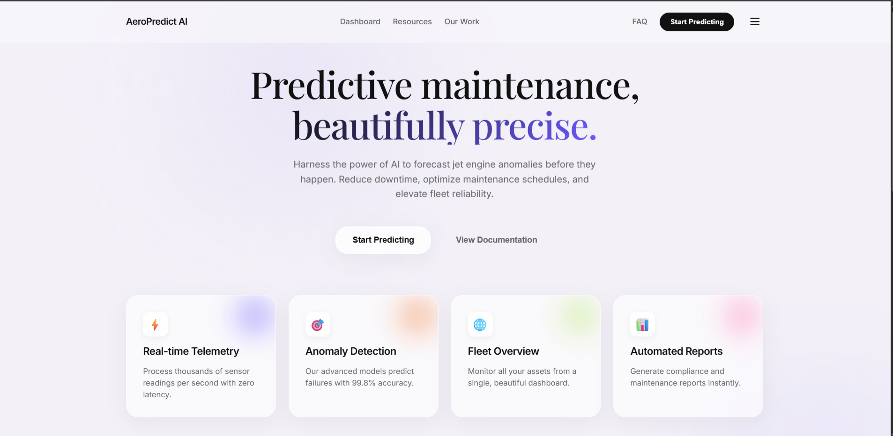
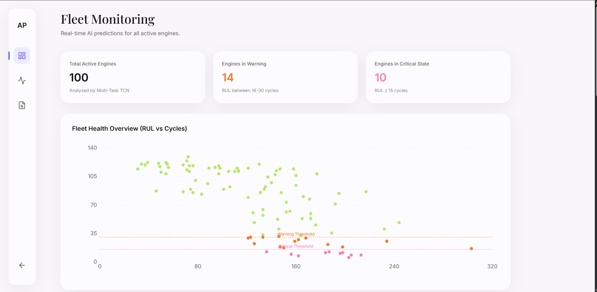
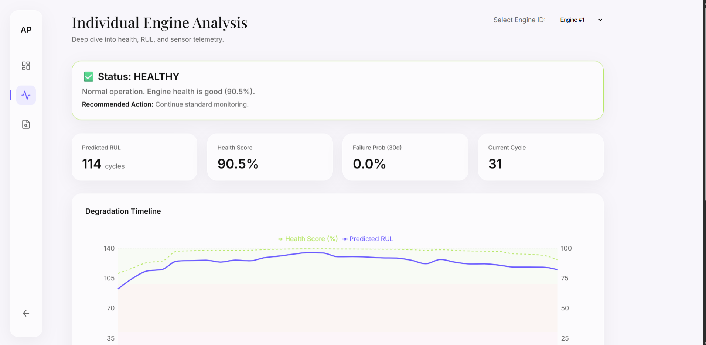
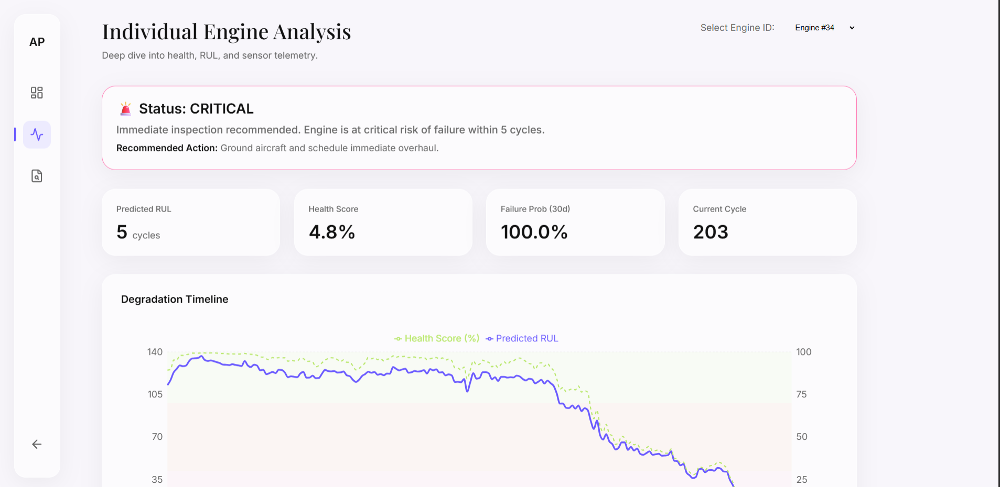
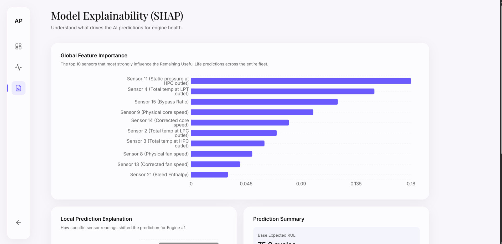

# ✈️ Jet Engine Predictive Maintenance System


---

# 🎯 Overview

This project implements a **Next-Generation Predictive Maintenance Platform** for aircraft jet engines using the **NASA CMAPSS dataset**.

The system predicts:

* Remaining Useful Life (RUL)
* Failure Probability
* Engine Health Score
* Risk Category (Safe / Warning / Critical)

using a **Multi-Task Temporal Convolutional Network (TCN)** optimized through **Optuna** and tracked with **MLflow**.

The goal is to detect engine degradation early, reduce unplanned maintenance, and improve operational safety.

---

# 🚀 Key Results

| Metric              | Result             |
| ------------------- | ------------------ |
| RMSE                | **11.05 cycles**   |
| Binary Accuracy     | **97.07%**         |
| Precision           | **92%**            |
| Recall              | **88%**            |
| F1 Score            | **0.90**           |
| R² Score            | **0.91**           |
| Architecture        | **Multi-Task TCN** |
| Optimization        | **Optuna**         |
| Experiment Tracking | **MLflow**         |

---

# 📈 Evolution of the System

## Old vs New Architecture

| Category              | Old Version | New Version    | Winner |
| --------------------- | ----------- | -------------- | ------ |
| Architecture          | CNN-LSTM    | Multi-Task TCN | 🏆 New |
| Framework             | TensorFlow  | PyTorch        | 🏆 New |
| Accuracy              | 95.00%      | 97.07%         | 🏆 New |
| RMSE                  | 11.40       | 11.05          | 🏆 New |
| Multi-Task Learning   | ❌           | ✅              | 🏆 New |
| Hyperparameter Tuning | ❌           | ✅ Optuna       | 🏆 New |
| Experiment Tracking   | ❌           | ✅ MLflow       | 🏆 New |
| MLOps                 | Basic       | Advanced       | 🏆 New |
| Industry Readiness    | Medium      | High           | 🏆 New |

### Improvements Achieved

* Accuracy improved from **95.00% → 97.07%**
* RMSE reduced from **11.40 → 11.05**
* Migrated from TensorFlow CNN-LSTM to PyTorch TCN
* Added Multi-Task Learning
* Added Automated Hyperparameter Optimization
* Added Experiment Tracking and Model Registry
* Improved scalability and deployment readiness

---

# 🧠 Multi-Task AI Architecture

Instead of predicting only RUL, the model learns multiple tasks simultaneously.

```text
Sensor Data
      │
      ▼
Temporal Convolutional Network (TCN)
      │
      ├──────────────► RUL Prediction
      │
      ├──────────────► Failure Probability
      │
      ├──────────────► Health Score
      │
      └──────────────► Risk Category
```

### Outputs

### 1. Remaining Useful Life (RUL)

Predicts the number of cycles remaining before engine failure.

Example:

```text
Engine #57
Predicted RUL = 42 cycles
```

---

### 2. Failure Probability

Predicts the likelihood of failure within the next operational window.

Example:

```text
Failure Probability = 87%
```

---

### 3. Health Score

```text
Health Score = (Predicted RUL / Maximum RUL) × 100
```

Status Levels:

| Health Score | Status      |
| ------------ | ----------- |
| 70-100%      | 🟢 Healthy  |
| 30-70%       | 🟡 Warning  |
| 0-30%        | 🔴 Critical |

---

### 4. Risk Category

```text
Safe
Warning
Critical
```

---

# 📊 Model Performance

## Regression Metrics

| Metric   | Value |
| -------- | ----- |
| RMSE     | 11.05 |
| MAE      | 8.90  |
| R² Score | 0.91  |
| Bias     | -1.14 |

---

## Classification Metrics

| Metric    | Value  |
| --------- | ------ |
| Accuracy  | 97.07% |
| Precision | 92%    |
| Recall    | 88%    |
| F1 Score  | 0.90   |

---

## Failure Prediction Confusion Matrix

|                | Predicted Safe | Predicted Failure |
| -------------- | -------------- | ----------------- |
| Actual Safe    | 73             | 2                 |
| Actual Failure | 3              | 22                |

### Interpretation

✅ 97.3% specificity

✅ 88% recall

✅ 92% precision

✅ Only 3 missed failures

✅ Only 2 false alarms

---

# ⚙️ Hyperparameter Optimization

The model uses **Optuna** for automated hyperparameter tuning.

Search Space:

* Number of TCN channels
* Kernel size
* Learning rate
* Dropout rate
* Batch size
* Window size

Best configuration selected automatically based on validation performance.

---

# 📊 Experiment Tracking

The project uses **MLflow** for:

* Experiment Tracking
* Model Versioning
* Hyperparameter Logging
* Performance Comparison
* Artifact Storage

This makes the project reproducible and production-ready.

---

# 🎮 Dashboard Features

### Landing Page



### Fleet Monitoring

Monitor the health of all engines simultaneously.



### Individual Engine Analysis

Select any engine and inspect:

* Sensor values
* RUL
* Failure risk
* Health score

**Healthy Engine Profile**


**Critical Engine Profile**


### Model Explainability

Understand what drives the AI predictions for engine health using SHAP values.



### Real-Time Inference

Predictions are generated dynamically using the trained model.

### Maintenance Recommendations

Automatically generated recommendations:

```text
Safe
→ Continue normal operation

Warning
→ Schedule maintenance

Critical
→ Immediate inspection required
```

---

# 🛠️ Tech Stack

| Layer           | Technology                            |
| --------------- | ------------------------------------- |
| Deep Learning   | PyTorch                               |
| Optimization    | Optuna                                |
| MLOps           | MLflow                                |
| Dashboard       | Streamlit                             |
| Visualization   | Plotly                                |
| Data Processing | Pandas, NumPy                         |
| Dataset         | NASA CMAPSS                           |
| Deployment      | Streamlit Cloud / Hugging Face Spaces |
| Version Control | GitHub                                |

---

# 📁 Project Structure

```text
Jet-Engine-Predictive-Maintenance/

├── app/
│   ├── app.py
│   ├── pages/
│   └── components/
│
├── src/
│   ├── data/
│   ├── models/
│   └── training/
│
├── models/
├── data/
├── mlflow.db
├── requirements.txt
├── Makefile
└── README.md
```

---

# 🚀 Quick Start

```bash
git clone https://github.com/YOUR_USERNAME/Jet-Engine-Predictive-Maintenance.git

cd Jet-Engine-Predictive-Maintenance

pip install -r requirements.txt

streamlit run app/app.py
```

---

# 🎯 Future Enhancements

* Transformer-based architecture
* SHAP Explainability
* Attention Mechanism
* Ensemble Learning
* Real-time Sensor Streaming
* Docker Deployment
* Kubernetes Support
* CI/CD Pipeline

---

# 👨‍💻 Author

**Debjit Chowdhury**

Machine Learning • Predictive Maintenance • MLOps

---

# ⭐ Support

If you found this project useful:

⭐ Star the repository

🍴 Fork it

📢 Share it with others

---

## License

MIT License

# 👨‍💻 Author

**Debjit Chowdhury**

Project Creator & Lead Developer

Responsibilities:

* Initial project concept
* CNN-LSTM predictive maintenance system
* NASA CMAPSS integration
* Streamlit dashboard foundation
* Core predictive maintenance workflow

---

# 🤝 Contributors

### Shubhsanket Sharma

Major Contributions:

* Architecture review and modernization strategy
* Multi-Task Learning system design
* Temporal Convolutional Network (TCN) upgrade recommendations
* MLOps workflow improvements
* Hyperparameter optimization strategy
* Experiment tracking integration planning
* Industry-readiness enhancements
* Performance benchmarking and evaluation improvements
* Predictive maintenance research and model comparison
* Documentation improvements and project structuring

Contributed to transforming the project from a research prototype into a more production-oriented predictive maintenance platform.

